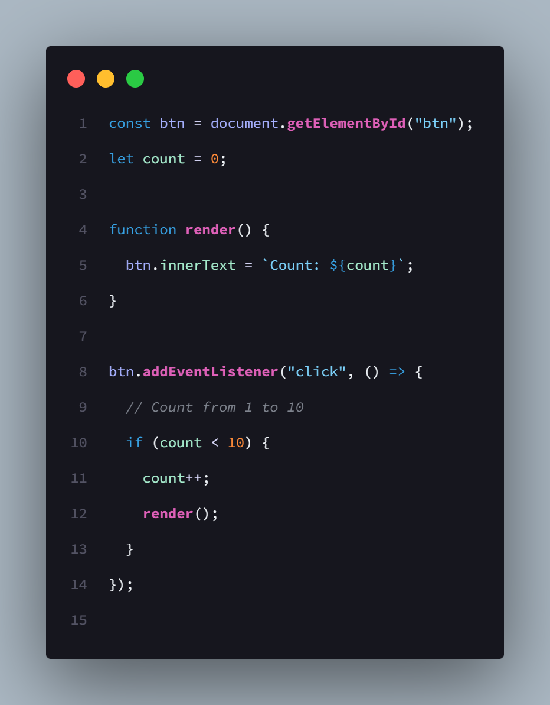
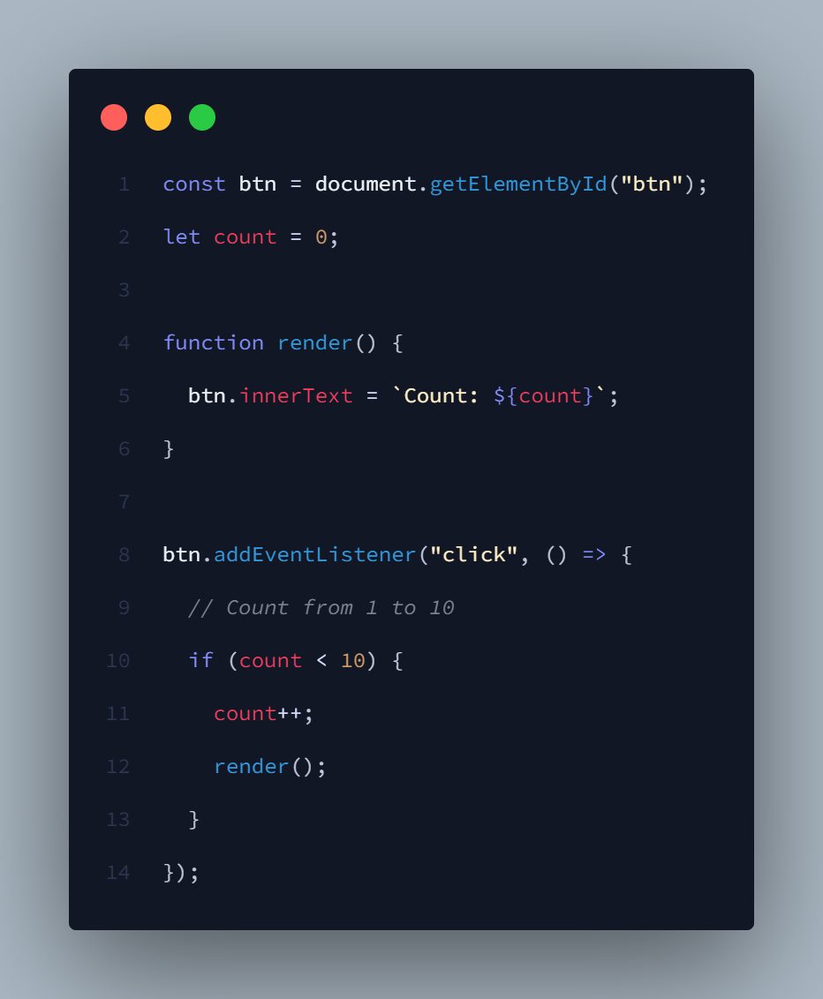
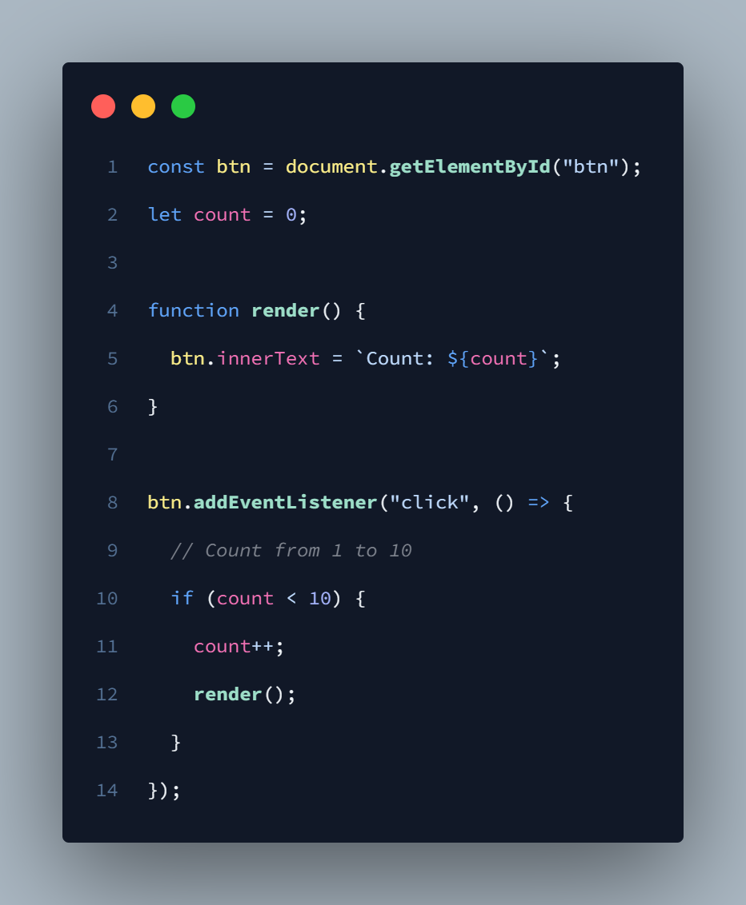

# Cool Roselia Theme

## Ayo Nonton Bang Dream!

<br>

## Preview

- ### Roselia - Orbital Eden


<br>
<br>

- ### Roselia - Rozen


<br>
<br>

- ### Morfonica - Pale Blue Night


<br>
<br>
<br>

## My VS Code Set Up

```json
{
  "workbench.colorTheme": "Roselia Theme",
  "workbench.activityBar.visible": false,
  "workbench.editor.showTabs": false,
  "editor.lineNumbers": "relative",
  "editor.renderLineHighlight": "none",
  "breadcrumbs.enabled": false,
  "editor.fontFamily": "Source Code Pro, JetBrainsMono NF",
  "workbench.startupEditor": "none",
  "editor.fontLigatures": true,
  "editor.lineHeight": 2.5
}
```

<br/>
<br/>

### Setelah meng-install Roselia Theme

### Nonchan:


